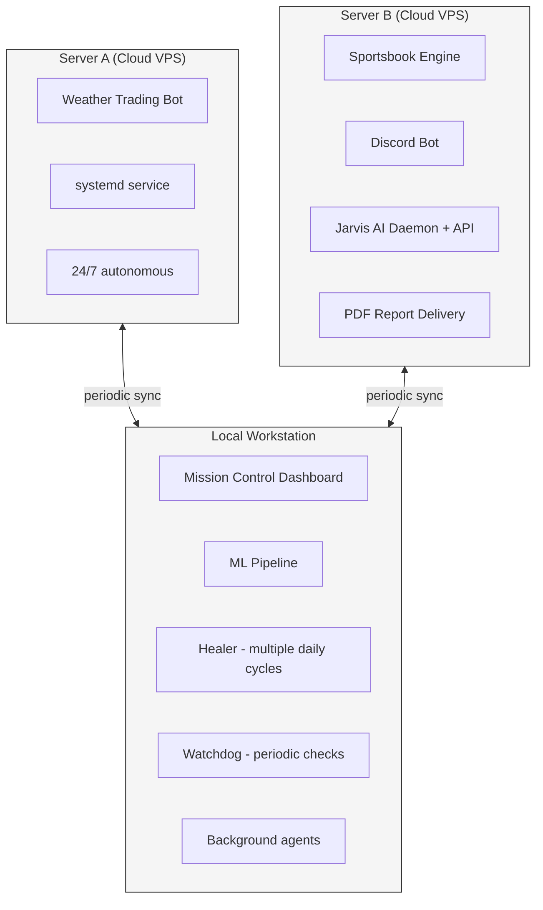
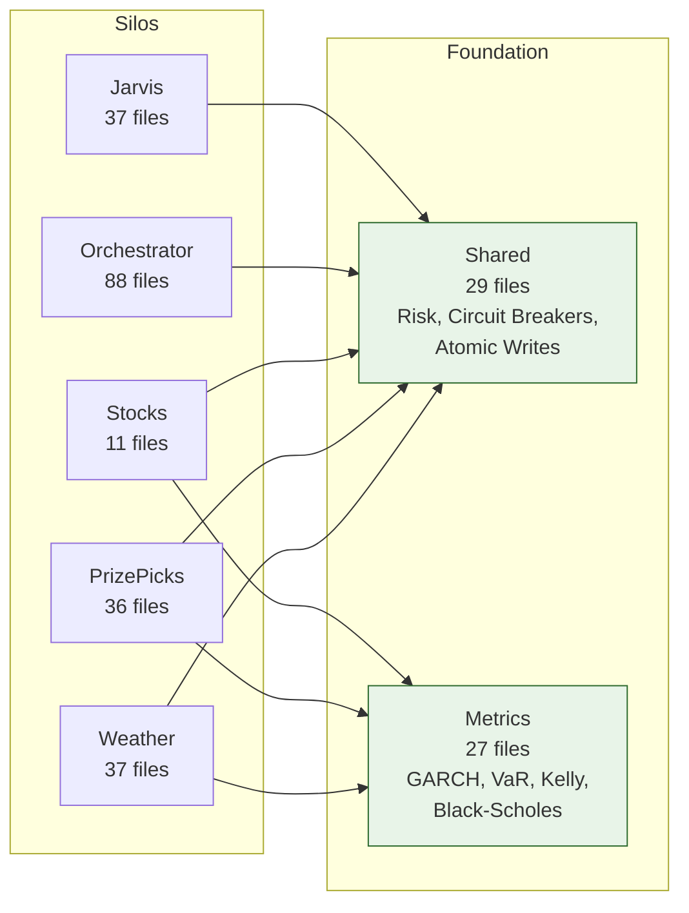

# Agentic Hedge Fund

**A 34-agent autonomous trading platform built by a non-engineer using Claude Code.**

311K lines of production code across 6 repositories, 3 servers, and 16 deployed applications. Built in under 90 days with zero prior programming background, using Claude Code as a collaborative coding medium.

This repository documents the architecture, governance framework, engineering process, and lessons learned. Strategy logic, credentials, and financial data remain private.

---

## Why This Exists

In December 2025 I started learning Python. I had no CS degree, no bootcamp, no engineering experience. I was a non-technical professional who found AI-assisted coding genuinely interesting.

I tested Codex, Grok, and Gemini before settling on Claude Code (Anthropic) after finding it substantially superior for production work. Over the next 90 days, across 3,277 sessions and roughly 1,000 hours, I built what became a multi-market autonomous trading platform with 34 AI agents, quantitative risk management, and self-healing infrastructure.

I share this not because the trading results matter (they are modest), but because the engineering process might be useful to others exploring what is possible with agentic coding tools.

---

## System Overview

```
┌─────────────────────────────────────────────────────────────┐
│                     CHAIRMAN (Human)                        │
│              Operational leadership + final say              │
└──────────────────────────┬──────────────────────────────────┘
                           │
┌──────────────────────────▼──────────────────────────────────┐
│                    STAFF CHIEF (Baker Model)                │
│         Pattern extraction, decision routing, memory        │
└──────┬───────┬───────┬───────┬───────┬───────┬─────────────┘
       │       │       │       │       │       │
   ┌───▼──┐┌──▼──┐┌──▼──┐┌──▼──┐┌──▼──┐┌──▼──┐┌──────────┐
   │Doctor││ CFO ││ CTO ││ CMO ││ CIO ││ COO ││   CSO    │
   │      ││     ││     ││     ││     ││     ││          │
   │Health││Fin. ││Tech ││Mktg ││Intel││ Ops ││  Sales   │
   └──┬───┘└──┬──┘└──┬──┘└──┬──┘└──┬──┘└──┬──┘└────┬─────┘
      │       │      │      │      │      │        │
      ▼       ▼      ▼      ▼      ▼      ▼        ▼
   20 strategy agents + 7 system agents + Security Guard
```

### Department Responsibilities

| Department | Head | Focus |
|-----------|------|-------|
| Health | Doctor | Freshness checks, health alerts, capital reconciliation |
| Finance | CFO | 20-check audit cycle, budget tracking, ROI analysis |
| Technology | CTO | API health, vendor evaluation, data quality |
| Marketing | CMO | Reports, dashboards, Discord delivery, PDF generation |
| Intelligence | CIO | Research cycles, IC process, learning oversight |
| Operations | COO | Process efficiency, SLA compliance, deployment |
| Sales | CSO | Sportsbook operations, quant scanner, affiliates |
| Security | Guard | Threat assessment, key hygiene, process security |

### Agent Categories

- **Department heads (7):** Each owns KPIs tracked in a scorecard system
- **Strategy agents (20):** Weather (11), PrizePicks (5), Quant Scanner (4)
- **System agents (7+):** Orchestrator, Healer, Watchdog, Chairman Mode, IC Queue Manager, IC Bridge, Staff Chief
- **Governance:** Investment Committee gates all capital allocation decisions

---

## Architecture

### Production Infrastructure



**Key infrastructure decisions:**
- **No database.** All data persisted as JSON files in a tracking directory, synced periodically across servers. Simple, auditable, easy to debug at 4 AM.
- **Atomic writes** using `fcntl.flock()` to prevent corruption during concurrent access.
- **Secret scrubbing** before all LLM API calls. Credentials isolated per server.
- **Self-healing.** Watchdog runs periodic health checks. Healer runs multiple daily cycles covering market hours.
- **Alerting** for system health, trade execution, and anomaly detection.

### Silo Architecture

Each domain module is isolated. Cross-module communication routes through the orchestrator. Modules import only from `shared/` and `metrics/`.



**Enforced by tests.** Import boundary violations are caught in CI. No strategy module can directly call another strategy module.

---

## Governance Framework

### CLAUDE.md Constitutions

14 project-level constitution files govern how AI agents behave across the codebase. Each repo has its own `CLAUDE.md` that defines:

- **Routing rules:** Which code lives where, which server runs what
- **Safety constraints:** What must never be deployed, what requires human approval
- **Data integrity rules:** Write + Monitor = Done (every tracking file needs a freshness check, outcome resolution loop, and heartbeat monitor)
- **Anti-patterns:** Named failure modes with programmatic guards

This is analogous to what OpenClaw does for agent governance, but built from scratch rather than using a third-party framework. The reasoning: production trading data should not pass through tools you do not fully control.

### Investment Committee Pattern

No strategy receives capital without IC approval:

```
Strategy proposes trade
    → IC Queue Manager validates data completeness
    → IC Bridge checks confidence thresholds
    → Doctor verifies system health
    → CFO confirms budget availability
    → Chairman reviews (or auto-approves within guardrails)
    → Execute or reject
```

**Safety gates at every level:**
- Circuit breaker: halts trading on excessive hourly loss
- T-bracket block: prevents trading in restricted time windows
- Win-streak reform: reduces position sizing during unusual win streaks (mean reversion)
- API dedup guard: prevents duplicate order submission
- Data-gap rejection: refuses to trade when critical data sources are missing

---

## The Six Anti-Patterns

Hard-won lessons from production failures. Each has a programmatic guard that prevents recurrence.

### 1. Silent Defaults
**Problem:** Functions that silently default to "today only" when no date range is specified, masking data coverage gaps.
**Guard:** All date-range functions require explicit parameters. No implicit defaults.

### 2. Stubs That Never Execute
**Problem:** Functions that log "would do X" but never actually execute, passing all tests while doing nothing in production.
**Guard:** Integration tests verify actual execution, not just logging output.

### 3. Data Staleness
**Problem:** Data paths with no freshness monitoring. A file stops updating and nobody notices for days.
**Guard:** Every tracking file has a Doctor freshness check with configurable staleness thresholds.

### 4. String Matching Without Normalization
**Problem:** Player names differ between data sources (Jr./Sr./III suffixes, Unicode diacritics, casing). Raw `.lower()` comparison misses matches.
**Guard:** All name comparisons route through a normalization utility that handles suffixes, diacritics, and casing.

### 5. Silent Exception Swallowing
**Problem:** Caught exceptions logged at `debug` level in production pipelines. Entire subsystems can fail silently.
**Guard:** Minimum `warning` level for caught exceptions in production. Debug-level exception logging is flagged in code review.

### 6. Phantom Data
**Problem:** Missing source data (season average = 0) still produces picks with high confidence grades, because the system defaults to phantom projections.
**Guard:** Critical data fields are validated before grade calculation. Missing data = rejected pick, not default value.

---

## Quantitative Suite

27 modules, 7,300+ lines. Integrated into live strategy sizing, not just CLI analysis tools.

| Module | Purpose | Integration |
|--------|---------|-------------|
| GARCH | Volatility modeling | BTC position sizing |
| VaR (Value at Risk) | Downside risk estimation | BTC + SOL guardrails |
| Monte Carlo Kelly | Optimal bet sizing with simulation | BTC + SOL sizing caps |
| Black-Scholes | Options pricing | Lottery Ticket enrichment |
| Frank-Wolfe (Rust + Python) | Portfolio optimization | Lottery Ticket allocation |
| Cointegration (ADF) | Pair stationarity testing | Combo Arb validation |
| Conformal Prediction | Distribution-free intervals | Weather confidence |
| Jump Diffusion | Fat-tail modeling | Risk scenarios |
| LMSR | Market scoring rule | Price calibration |
| Options Greeks | Delta, gamma, theta, vega | Options flow analysis |
| Edge Decay Monitor | Rolling win-rate vs all-time | Catches strategy degradation |
| Sharpe Ratio | Risk-adjusted returns | Doctor health scoring |
| Brier Score | Probability calibration | Forecast accuracy |
| Significance Tests | Binomial, z-tests | Strategy validation |

**XGBoost ML pipelines** with strict chronological splits (no future data leakage). Trained models use JSON serialization only (no pickle, no arbitrary code execution).

---

## Dashboard

Next.js 16 / React 19 / TypeScript / Tailwind CSS mission control dashboard. 31K lines, 20 pages, 63 API routes.

```
Pages:
├── Command Center (system overview)
├── Trading Terminal (execution + monitoring)
├── Strategy dashboards (per-market views)
├── Org Chart (agent topology visualization)
├── Jarvis AI Chief (chat + status)
├── Deep-Dive Intelligence (graph analysis)
├── Project Genome (cross-project health)
└── ... 13 more
```

**Cross-project file reading.** API routes read JSON tracking files from sibling project directories. No database layer. The dashboard is a read-only window into the state of the entire system.

**Polling architecture.** Frontend components use a custom polling hook to stay current without websocket complexity.

---

## Engineering Process

### Plan Before Code
86 architecture plan documents serve as session bridges. When a Claude Code session hits context limits and compacts, the plan document preserves intent and decisions. Without this, context compaction causes hallucination drift (the AI subtly changes approach after losing earlier context).

### Batch Execution Model
Complex tasks split into batches of 3-4 subtasks. Each batch gets its own subagent with a self-contained prompt. Checkpoint between batches. This prevents the orchestrating session from losing detail during long operations.

### Test Everything
4,085 tests across 214 files. Every bug fix ships a regression test. ML pipelines use chronological splits. Import boundaries enforced by test. PR-style review before merge.

### Name the Failures
The 6 anti-patterns above each have a name, a story, and a guard. Naming failures makes them detectable. Unnamed failures repeat.

### Audit Relentlessly
Regular sweeps for dead code, orphaned modules, and stale data paths. 222 machine-learned patterns feed into live strategy sizing adjustments. Edge decay monitor catches strategy degradation before losses accumulate.

### Know When to Stop
Retired 2 strategies and killed 1 ML research line (a language model approach that showed no predictive signal despite promising architecture). Sunk cost is not a reason to continue.

---

## Knowledge Infrastructure

- **100-document Obsidian vault** organized by strategy, operations, and shared knowledge
- **222 machine-learned patterns** feeding live strategy sizing via a learnings advisor
- **110+ curated lessons** in a human-readable learning journal
- **33 process-gap documents** tracking known issues with YAML metadata
- **Edge decay monitor** comparing rolling 30-day win rate against all-time, flagging >10 percentage point drops
- **Web research and semantic search APIs** for real-time information gathering
- **15+ MCP server integrations** for browser automation, market data, knowledge management, document processing, and scheduling

---

## By the Numbers

| Metric | Value | Detail |
|--------|-------|--------|
| Production LOC | 311,085 | 4.1M+ total written |
| Tests | 4,085 | 214 test files |
| Commits | 751 | Under 90 days |
| Hours | 1,000+ | Many at 4 AM |
| Tokens | ~50M | 1.6 GB session transcripts |
| Sessions | 3,277 | With Claude Code |
| Agents | 34 | 7 departments |
| Servers | 3 | Cloud + local |
| Web Apps | 5 | Next.js, React, FastAPI |
| CLI Tools | 11 | Python |
| Quant Modules | 27 | 7,300+ lines |
| MCP Integrations | 15+ | Various providers |

---

## Stack

| Category | Technologies |
|----------|-------------|
| Languages | Python 3.13+, TypeScript, Rust, SQL |
| Frameworks | Next.js 16, React 19, FastAPI, Tailwind CSS, Vite, Recharts, ReactFlow |
| ML / Quant | XGBoost, PyTorch (Apple MPS), GARCH, VaR, Monte Carlo, Black-Scholes, Frank-Wolfe |
| Infrastructure | Cloud VPS (x2), systemd, Docker, LaunchAgents, cron, SCP |
| Data / Security | SQLite, JSON pipelines, atomic writes (fcntl), secret scrubbing, credential isolation |
| Testing | pytest (4,085 tests), chronological ML splits, anti-pattern guards, import boundary tests |
| AI Tooling | Claude Code (4 model tiers), 15+ MCP servers, 12 custom skills |

---

## Department Autonomy Roadmap

The system is designed to progressively increase agent autonomy:

| Phase | Mode | Status |
|-------|------|--------|
| 1 | Paper trade, human reviews all signals | Current for new strategies |
| 2 | Bot recommends via Discord, human executes | Current for proven strategies |
| 3 | Bot executes within guardrails, human gets notifications | Active for highest-conviction strategies |
| 4 | Autonomous with daily digest only | Target state |

Each strategy must prove itself at each phase before advancing. The Investment Committee pattern ensures no strategy skips gates.

---

## Security

This repository contains no credentials, server IPs, strategy logic, or financial data. A pre-commit hook ([`scripts/secret_scanner.py`](scripts/secret_scanner.py)) scans every commit for:

- API key patterns (Anthropic, AWS, OpenAI, generic)
- SSH keys and PEM references
- Non-private IP addresses
- Personal file paths and home directories
- Phone numbers and email addresses
- Webhook URLs and database connection strings
- Environment variable assignments

The scanner has [23 tests](tests/test_secret_scanner.py) covering all pattern categories plus false-positive checks on clean code.

**To install the hook after cloning:**
```bash
bash scripts/install_hooks.sh
```

---

## About

Built by a non-technical professional learning to become a software engineer. This project represents what is possible when someone with zero programming background commits serious time and effort to building with AI coding tools.

I am looking for my first engineering role. If this work interests you, I would welcome a conversation. Reach out via GitHub.

---

*All metrics verified from git history, Claude Code session logs (1.6 GB on disk), and production tracking files. Last updated March 2026.*
